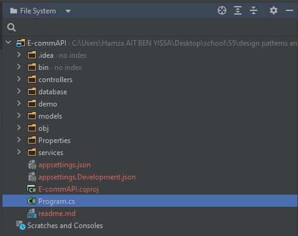
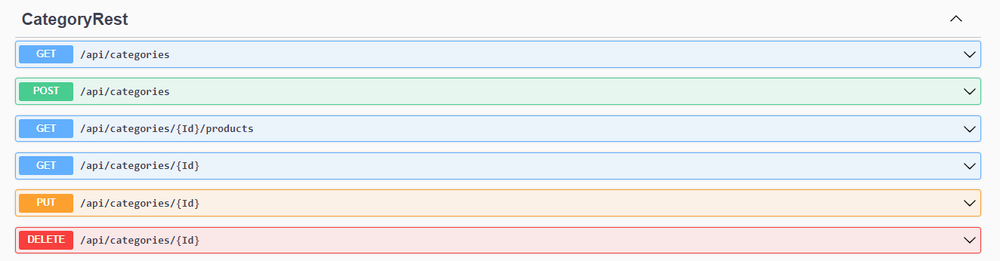
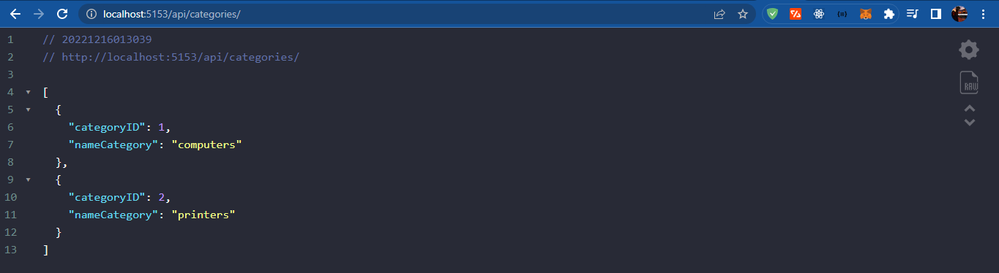
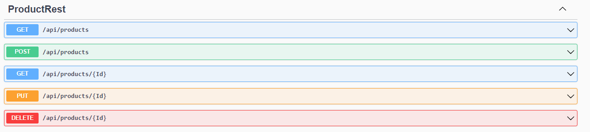
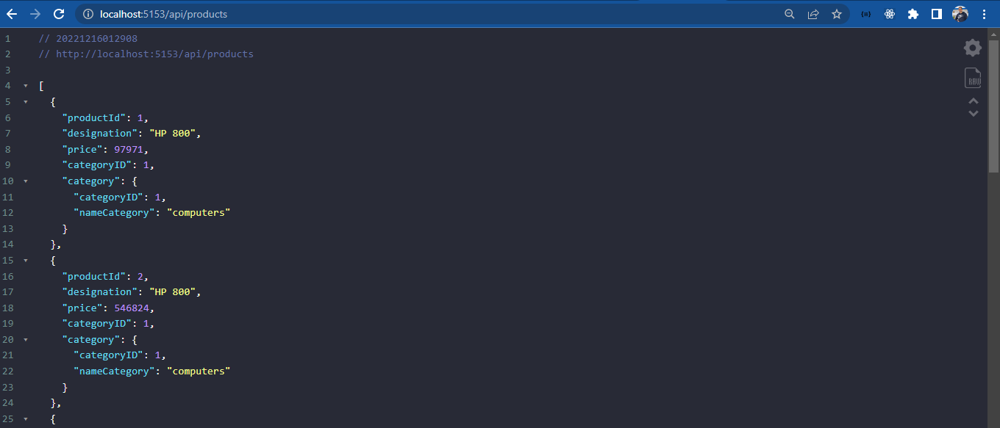

# .NET Core 7 Web Api for managing products and categories

## Table of contents

- [Project Architecture](#project-Architecture)
- [Category Controller](#Category-Controller)
- [Product Controller](#invoice-service)

## Project Architecture

In this project we have the following services:

    1. Models :
        here we will put Category and Product entities
    2. Database :
        used for managing the catgory and product repositories by extending DbContext of EntityFrameworkCore 
    3. Controllers:
        Handling CRUD operations for products and categories
    4. Services :
        Bussiness Logic should be here , and also operations of initialization 😎
    5. Program File :
          A file to configure and boot our application

 

 

## Category Controller

 

 

 

 

## Product Controller

 

 

 

 

## 🔗 About me :

